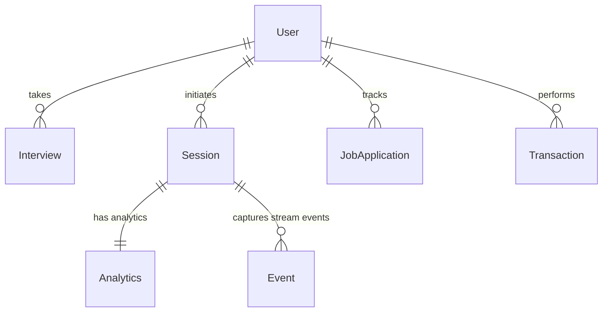

# Database Schema - SpeakEase-AI

This document provides a comprehensive overview of the MongoDB database schema used in the **SpeakEase-AI** project. The backend models are defined using **Mongoose** (MongoDB object modeling).

---

## Entity Relationship Overview

The project uses MongoDB collections connected through reference relationships (e.g., referencing `User` and `Session` documents):

---

## 1. User Schema (`User.js`)
Represents registered users, tracking their basic details, credits, preparation statistics, and plan details.

| Field | Type | Validation / Options | Default | Description |
| :--- | :--- | :--- | :--- | :--- |
| `name` | String | Required | - | The user's name |
| `email` | String | Required, Unique | - | The user's email address |
| `firebaseUid` | String | - | - | Firebase authentication unique identifier |
| `passwordHash` | String | - | - | Salted hash of password (if local auth) |
| `college` | String | - | - | College name |
| `yearOfStudy` | String | - | - | Year of study (e.g. 1st, 2nd, 3rd, 4th) |
| `preferredLanguage`| String | - | `'JavaScript'` | Target programming language for coding rounds |
| `credits` | Number | - | `10` | Balance of credits for interview simulation |
| `totalInterviews` | Number | - | `0` | Total interviews taken |
| `averageScore` | Number | - | `0` | User's average performance score |
| `resumeData` | Object | - | `null` | Parsed resume data structure |
| `targetCompanies` | Array[String]| - | `[]` | Companies the user is targetting |
| `plan` | String | Enum: `['free', 'pro']` | `'free'` | Subscription tier |
| `stats` | Object | - | See below | Nested object for track stats |
| `stats.readinessScore` | Number | - | `0` | Computed AI readiness score |
| `stats.interviewsTaken` | Number | - | `0` | Sub-count of interviews taken |
| `stats.practiceHours` | Number | - | `0` | Sub-count of practice hours |
| `stats.weakTopic` | String | - | `''` | Identified weak topics/concepts |
| `createdAt` | Date | - | `Date.now` | Creation timestamp |

---

## 2. Interview Schema (`Interview.js`)
Stores structured interview sessions, questions asked, user answers, and individual & overall metrics.

### QuestionSchema (Nested Subdocument)
Used to structure each question within an interview session.

| Field | Type | Validation / Options | Default | Description |
| :--- | :--- | :--- | :--- | :--- |
| `questionText` | String | Required | - | The question prompt text |
| `difficulty` | String | Enum: `['Beginner', 'Intermediate', 'Advanced']` (Required) | - | Difficulty level |
| `type` | String | Enum: `['technical', 'hr', 'coding']` | `'technical'` | Round type |
| `topic` | String | - | `''` | Topic category (e.g., "OS", "OOPs") |
| `resumeContext` | String | - | `''` | Connection to user's resume |
| `hint` | String | - | `''` | Optional hint for the user |
| `userAnswer` | String | - | `''` | Transcript of user's answer |
| `metrics.confidence` | Number | Min: 0, Max: 100 | `null` | User's confidence score |
| `metrics.feedback` | String | - | `''` | AI feedback for this response |
| `metrics.technicalCorrectness` | Number | Min: 0, Max: 100 | `null` | correctness score |
| `metrics.problemSolving` | Number | Min: 0, Max: 100 | `null` | Problem-solving depth score |
| `metrics.technicalDepth` | Number | Min: 0, Max: 100 | `null` | Technical depth score |
| `metrics.communicationSkills` | Number | Min: 0, Max: 100 | `null` | Clarity of expression score |
| `metrics.clarity` | Number | Min: 0, Max: 100 | `null` | clarity/articulation score |
| `metrics.professionalTone` | Number | Min: 0, Max: 100 | `null` | Tone matching professionalism |
| `metrics.emotionalIntelligence` | Number | Min: 0, Max: 100 | `null` | Emotional quotient indicators |
| `metrics.eyeContactScore` | Number | Min: 0, Max: 100 | `null` | Eye contact consistency |
| `metrics.attentionScore` | Number | Min: 0, Max: 100 | `null` | Focus / engagement score |
| `metrics.smileScore` | Number | Min: 0, Max: 100 | `null` | Smiling quotient |
| `metrics.nervousnessScore` | Number | Min: 0, Max: 100 | `null` | Estimated anxiety indicators |
| `metrics.behaviorSummary` | String | - | `''` | Overall behavioral summary |
| `metrics.fillerCount` | Number | - | `0` | Number of filler words used |
| `metrics.wpm` | Number | - | `0` | Words per minute |

### InterviewSchema (Main Document)
| Field | Type | Validation / Options | Default | Description |
| :--- | :--- | :--- | :--- | :--- |
| `userId` | ObjectId | Ref: `'User'` (Required) | - | Reference to the taking User |
| `role` | String | Required | - | Job role being interviewed for |
| `experienceLevel`| String | Required | - | Experience level (e.g., 'Freshman', 'Senior') |
| `company` | String | - | `''` | Targeted company (if applicable) |
| `topic` | String | - | `''` | Specific topic filter (if applicable) |
| `resumeText` | String | - | `''` | Raw resume text utilized for generation |
| `interviewType` | String | Enum: `['technical', 'hr', 'full-simulation', 'practice']` (Required) | `'technical'` | Type of interview round |
| `mode` | String | Enum: `['standard', 'technical-only']` | `'standard'` | Interview configuration mode |
| `interviewPhase`| String | Enum: `['coding', 'technical', 'hr', 'completed']` | `'technical'` | Current active phase |
| `currentQuestionIndex` | Number| - | `0` | Current question index |
| `totalQuestionsAsked` | Number| - | `0` | Total questions asked in session |
| `codingResults` | Array | `[QuestionSchema]` | `[]` | Results for coding round |
| `technicalResults`| Array | `[QuestionSchema]` | `[]` | Results for technical round |
| `hrResults` | Array | `[QuestionSchema]` | `[]` | Results for HR round |
| `status` | String | Enum: `['Pending', 'In Progress', 'Completed']` | `'Pending'` | Interview completion state |
| `codingScore` | Number | - | `0` | Aggregated coding round score |
| `technicalScore`| Number | - | `0` | Aggregated technical round score |
| `hrPerformance` | Number | - | `0` | Aggregated HR round score |
| `overallScore` | Number | - | `0` | Overall calculated score |
| `finalFeedback` | String | - | `''` | Summary AI assessment report |
| `strengths` | Array[String] | - | `[]` | Key strengths highlighted by AI |
| `improvements` | Array[String] | - | `[]` | Key improvement areas highlighted by AI |
| `videoUrl` | String | - | `''` | URL pointing to video recording |
| `createdAt` | Date | - | `Date.now` | Creation timestamp |

---

## 3. Session Schema (`Session.js`)
Tracks the real-time processing state and content generated for interview practice sessions.

### questionSchema (Nested)
| Field | Type | Description |
| :--- | :--- | :--- |
| `id` | Number | Question Identifier |
| `category` | String | Question category (e.g. OOP, DBMS, Behaviourial) |
| `difficulty` | String | Difficulty level |
| `question` | String | Question text |
| `whyAsked` | String | Rationale for asking this |
| `expectedPoints` | Array[String]| List of expected points/keywords in answer |
| `transcript` | String | Transcribed user answer |
| `answerScore` | Number | Score evaluated |
| `improvement` | String | Targeted feedback |

### sessionSchema (Main Document)
| Field | Type | Validation / Options | Default | Description |
| :--- | :--- | :--- | :--- | :--- |
| `userId` | ObjectId | Ref: `'User'` (Required) | - | Target user |
| `targetRole` | String | - | - | Targeted role |
| `targetCompanies`| Array[String]| - | - | Target companies |
| `experienceLevel`| String | - | - | Target experience level |
| `interviewMode` | String | Enum: `['technical', 'hr', 'full']` | - | Mode |
| `resumeText` | String | - | - | Resume parsed text context |
| `questions` | Array | `[questionSchema]` | `[]` | Question structures |
| `currentQuestionIdx`| Number | - | `0` | Index of active question |
| `videoUrl` | String | - | - | Video file URL |
| `durationMs` | Number | - | - | Duration of session in ms |
| `status` | String | Enum: `['ready', 'recording', 'processing', 'done']` | `'ready'` | Current status |
| `recordedAt` | Date | - | `Date.now` | Record date |

---

## 4. Event Schema (`Event.js`)
Captures real-time stream event metrics during video/audio recordings.

| Field | Type | Validation / Options | Description |
| :--- | :--- | :--- | :--- |
| `sessionId` | ObjectId | Ref: `'Session'` (Required) | Reference to active Session |
| `type` | String | Enum: `['filler_word', 'eye_contact_lost', 'long_pause', 'word']` | Type of streamed metric/event detected |
| `timestampMs` | Number | Required | Timestamp offset in milliseconds |
| `endMs` | Number | - | End offset in milliseconds (for durational events) |
| `word` | String | - | Specific word (if type is filler/word) |
| `eyeScore` | Number | - | Score indicating eye contact |
| `pauseDurMs` | Number | - | Pause duration in ms (if type is long_pause) |

*   **Indexes**: Compounded index `{ sessionId: 1, timestampMs: 1 }` is maintained for performant event queries.

---

## 5. Analytics Schema (`Analytics.js`)
Stores consolidated speech & behavior analytics compiled upon Session completion.

### questionScoreSchema (Nested)
| Field | Type | Description |
| :--- | :--- | :--- |
| `questionId` | Number | Reference to question number |
| `score` | Number | Evaluation score |
| `verdict` | String | Assessment summary (e.g. Good/Poor) |
| `improvement` | String | Specific constructive criticism |

### analyticsSchema (Main Document)
| Field | Type | Validation / Options | Default | Description |
| :--- | :--- | :--- | :--- | :--- |
| `sessionId` | ObjectId | Ref: `'Session'` (Required, Unique) | - | Target Session |
| `fillerCount` | Number | - | - | Total occurrences of filler words |
| `fillerBreakdown.um` | Number | - | - | Count of "um" filler |
| `fillerBreakdown.uh` | Number | - | - | Count of "uh" filler |
| `fillerBreakdown.like`| Number | - | - | Count of "like" filler |
| `fillerBreakdown.basically`| Number| - | - | Count of "basically" filler |
| `fillerBreakdown.literally`| Number| - | - | Count of "literally" filler |
| `eyeContactPct` | Number | - | - | Percentage of interview maintaining eye contact |
| `avgPauseSec` | Number | - | - | Average pause length in seconds |
| `longPauseCount`| Number | - | - | Number of distinct long pauses |
| `totalWords` | Number | - | - | Total words spoken in session |
| `wordsPerMin` | Number | - | - | Speech speed rating (WPM) |
| `overallScore` | Number | - | - | Aggregated final score |
| `feedbackReport`| String | - | - | Comprehensive final text review report |
| `questionScores`| Array | `[questionScoreSchema]` | `[]` | Array of per-question scorecards |
| `generatedAt` | Date | - | `Date.now` | Computation timestamp |

---

## 6. Question Pool Schema (`Question.js`)
Serves as the general question bank populated for interview preparation.

| Field | Type | Validation / Options | Default | Description |
| :--- | :--- | :--- | :--- | :--- |
| `company` | String | - | `'General'` | Specific target company |
| `role` | String | - | `'Software Engineer'` | Target role designation |
| `round` | String | Enum: `['Coding', 'Technical', 'HR']` | `'Technical'` | Type of interview round |
| `topic` | String | Required | - | Core topic/technology (e.g. "React") |
| `difficulty` | String | Enum: `['Beginner', 'Intermediate', 'Advanced']` (Required) | - | Level of question |
| `question` | String | Required | - | The exact question text |
| `solution` | String | - | `''` | Ideal solution/answer guideline |
| `explanation`| String | - | `''` | Deeper explanation details |
| `tags` | Array[String]| - | `[]` | Custom search/categorization tags |

*   **Timestamps**: Built-in mongoose tracking enabled (`createdAt`, `updatedAt`).

---

## 7. Job Application Schema (`JobApplication.js`)
Allows users to log and track their applications progress.

| Field | Type | Validation / Options | Default | Description |
| :--- | :--- | :--- | :--- | :--- |
| `userId` | ObjectId | Ref: `'User'` (Required) | - | Reference to User |
| `company` | String | Required | - | Name of company applied to |
| `role` | String | Required | - | Job role applied for |
| `status` | String | Enum: `['Applied', 'Interviewing', 'Offered', 'Rejected']` | `'Applied'` | Current application stage |
| `appliedDate`| Date | - | `Date.now` | Date of application |
| `notes` | String | - | `''` | User custom notes |
| `createdAt` | Date | - | `Date.now` | Creation timestamp |

---

## 8. Transaction Schema (`Transaction.js`)
Tracks razorpay orders and financial purchases of interview credits.

| Field | Type | Validation / Options | Default | Description |
| :--- | :--- | :--- | :--- | :--- |
| `userId` | ObjectId | Ref: `'User'` (Required) | - | Paying User |
| `razorpayOrderId`| String | Required | - | Order identifier returned by Razorpay |
| `razorpayPaymentId`| String | - | - | Payment verification token |
| `amount` | Number | Required | - | Payment amount |
| `creditsAdded` | Number | Required | - | Number of credits purchased |
| `status` | String | Enum: `['Created', 'Success', 'Failed']` | `'Created'` | Transaction final state |
| `createdAt` | Date | - | `Date.now` | Creation timestamp |

