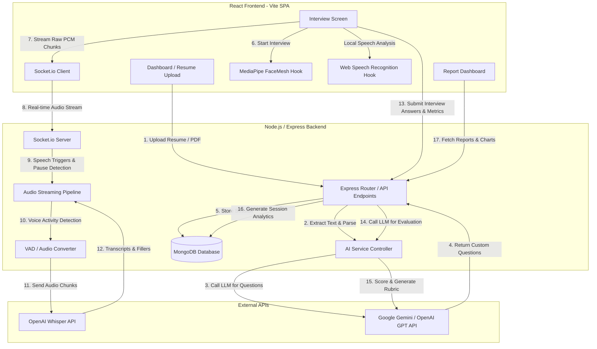

# SpeakEase-AI: Project Architecture, Tech Stack, & System Flow

SpeakEase-AI is an advanced, AI-powered mock interview preparation platform designed to help candidates practice, analyze, and refine their interview skills. By combining real-time computer vision (facial tracking), audio/speech analysis, and generative AI models, SpeakEase-AI provides granular, multimodal feedback on both **what** a candidate says (verbal content) and **how** they say it (non-verbal delivery, eye contact, and pacing).

---

## 1. High-Level Technical Architecture

SpeakEase-AI follows a classic modern web application architecture: a **Vite + React Single Page Application (SPA)** client communicating with a **Node.js + Express** server over both HTTP REST APIs and WebSockets (`socket.io`), backed by a **MongoDB** database.

---

## 2. Tech Stack and Individual Technology Purposes

The project leverages a robust ecosystem of client-side tracking, audio processing, and AI orchestration technologies:

### **Frontend (Client-side)**
*   **Vite + React (SPA)**: Serves as the high-performance core framework. Vite guarantees extremely fast builds, hot module reloading, and optimized asset loading, essential for smooth webcam-based UIs.
*   **MediaPipe Face Mesh (via `@mediapipe/face_mesh`)**: Executed directly in the user's browser, it tracks 468+ facial landmarks and iris points in real-time. This is utilized to calculate:
    *   *Eye Contact*: Relative position of iris landmarks within the eye contours, compensated for head rotations.
    *   *Attention Score*: Head pose estimations (Yaw, Pitch, Roll) determining if the candidate is looking at the screen or looking away.
    *   *Blink Detection*: Tracks Eye Aspect Ratio (EAR) variations to calculate blink rates and identify excessive blinking.
*   **Web Speech API (`SpeechRecognition`)**: A native browser utility that transcribes user speech in real-time. SpeakEase-AI uses it client-side to instantly detect filler words (e.g., *"um"*, *"uh"*, *"like"*) and compute live words-per-minute (WPM) metrics shown in the HUD.
*   **Recharts**: A declarative chart library for React, used in the final Report Dashboard to display clean, responsive radar charts, pacing area graphs, and eye contact timelines.
*   **Lucide React**: Provides modern, lightweight SVG icons that maintain a premium visual aesthetic.

### **Backend (Server-side)**
*   **Node.js & Express**: The asynchronous backend engine hosting HTTP REST endpoints for user authentication, session management, resume upload, and scoring triggers.
*   **Socket.io (WebSockets)**: Handles full-duplex, low-latency communication. During interviews, it streams raw audio chunks from the browser microphone to the backend for independent speech analytics.
*   **MongoDB & Mongoose**: A flexible NoSQL database storing:
    *   `User`: Accounts, profiles, and password hashes (secured via `bcrypt`).
    *   `Interview` & `Session`: Configured questions, answers, and visual/audio analytics history.
    *   `Event`: Granular timeline log (e.g., "lost eye contact at 0:42", "filler word at 1:15").
*   **pdf-parse / Multer**: Handles incoming binary multipart forms (uploaded resumes and recorded HD interview videos) and extracts raw text from PDF files.
*   **Voice Activity Detection (VAD) via RMS calculation**: A lightweight backend algorithm that calculates Root Mean Square (RMS) values of audio chunks to identify silence thresholds and segment user speech.
*   **OpenAI Whisper API**: Receives converted backend PCM/WAV audio streams to generate highly accurate speech-to-text transcriptions and serve as a reliable backup/audit for the browser-based Speech Recognition.
*   **Gemini API / OpenAI GPT (Orchestrated in `aiService.js`)**: The "brain" of the platform, utilized for:
    *   Generating customized technical/coding/HR interview questions matching the uploaded resume.
    *   Providing granular textual feedback, identifying conceptual gaps, and grading answers based on an rubrics assessment (relevance, structure, accuracy).

---

## 3. End-to-End System and Data Flow

The user journey through SpeakEase-AI proceeds through four core stages:

### **Phase 1: Resume Analysis & Question Generation**
1. The user logs in and uploads their resume (`.pdf` or `.docx`).
2. `resumeController.js` stores the file and extracts raw text via `pdf-parse`.
3. The server forwards the text to `aiService.js`, which constructs a structured prompt instructing the AI to analyze the candidate's skills, seniority, projects, and target industry.
4. The AI returns a structured JSON containing:
   * Key technologies and experience levels.
   * Suggested behavioral/HR questions.
   * Custom technical and coding questions.
5. The server creates an `Interview` configuration object in MongoDB, saving the generated questions.

### **Phase 2: The Real-time Interview Session (`InterviewPage.jsx`)**
1. The user selects their interview parameters and starts the session.
2. The browser launches the webcam and microphone, initializing:
   * The **MediaPipe FaceMesh** tracking loop via `useFaceMesh.js` (~30 frames per second).
   * The **Web Speech API** loop via `useAudioAnalyser.js`.
   * A **Socket.io connection** to stream audio blobs to the server.
3. The virtual interviewer reads out the first question using Text-to-Speech (TTS).
4. The candidate clicks **"Start Answer"** and speaks:
   * **Visual tracking**: Every frame, facial landmarks are analyzed. If eye contact dips below a threshold (e.g. looking away to formulate a thought), a temporary timer starts. If attention is lost for more than 3 seconds, a "lost eye contact" event is recorded in the session's event stream.
   * **Client-side audio**: The browser transcribe-as-you-speak loops through words, checking against filler arrays and calculating words-per-minute.
   * **Server-side audio**: Audio chunks are streamed over sockets, piped to `pipelineController.js`, evaluated for silences/pauses via `vad.js`, and finalized chunks are sent to Whisper for deep analytical transcription.
5. The candidate clicks **"Submit Answer"**, and the accumulated metrics (eye contact ratio, blink count, pacing, filler counts, transcripts) are packaged and POSTed to `/interview/evaluate`.

### **Phase 3: Post-Interview Scoring & Weighting**
1. When the interview ends, the client triggers the final session finalization.
2. `reportController.js` and `analyticsGenerator.js` compile the metrics:
   * The server-side generative AI evaluates the answer content, outputting a technical rating (0-100).
   * Behavioral metrics are combined: visual engagement (eye contact, posture) is given a weighted percentage (typically 20% of the overall segment score).
   * Speech metrics (pacing consistency, absence of fillers, appropriate pause structures) contribute another weighted percentage.
3. The backend aggregates these into a final `Analytics` document and stores it in the database.

### **Phase 4: Feedback and Dashboard Rendering**
1. The user is redirected to the `ReportDashboard.jsx`.
2. The UI fetches data from `/analysis/:id/report` and renders:
   * **Overall Competency Score**: Shown as a clean visual indicator.
   * **Behavioral Analysis Section**: Renders eye contact consistency and blink events on a timeline.
   * **Communication Visuals**: Renders WPM pace compared to the target "optimal" zone (120-150 WPM) and filler word distribution.
   * **AI Answer Review**: Displays each question side-by-side with the candidate's transcript, indicating grammatical improvements, missing technical keywords, and a detailed scoring rubric.

---

## 4. Key Files Reference

*   [**`client/src/services/behaviorAnalysis.js`**](file:///d:/SpeakEase-AI/client/src/services/behaviorAnalysis.js): Core math functions for client-side iris/eye tracking, EAR ratios, and head coordinates.
*   [**`client/src/hooks/useFaceMesh.js`**](file:///d:/SpeakEase-AI/client/src/hooks/useFaceMesh.js): React hook encapsulating webcam drawing and FaceMesh execution.
*   [**`client/src/hooks/useAudioAnalyser.js`**](file:///d:/SpeakEase-AI/client/src/hooks/useAudioAnalyser.js): React hook utilizing `SpeechRecognition` to track spoken pacing and fillers.
*   [**`server/services/pipelineController.js`**](file:///d:/SpeakEase-AI/server/services/pipelineController.js): Backend manager for incoming WebSocket audio stream.
*   [**`server/services/aiService.js`**](file:///d:/SpeakEase-AI/server/services/aiService.js): Central orchestrator for calls to Whisper and Gemini.
*   [**`server/controllers/interviewController.js`**](file:///d:/SpeakEase-AI/server/controllers/interviewController.js): Evaluation engine calculating performance values and persisting results.
